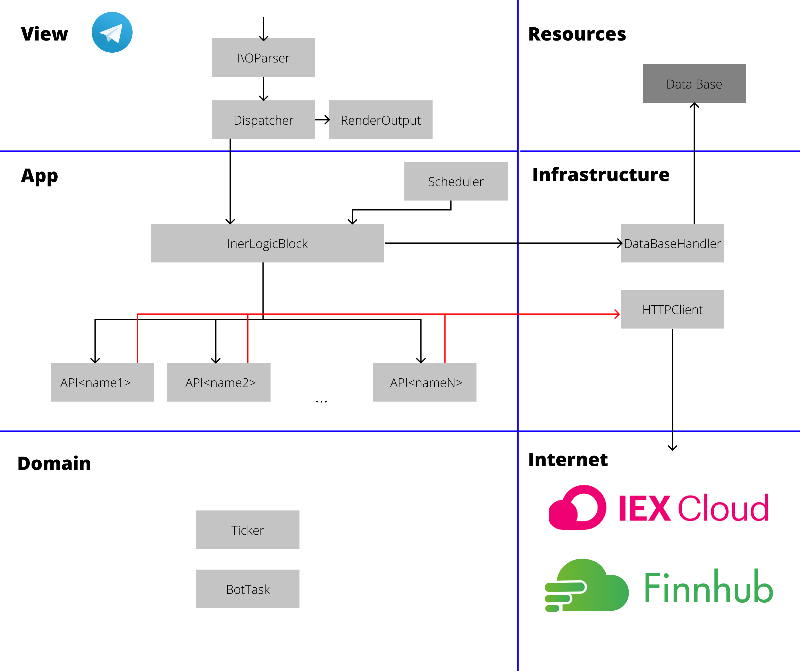

# telegram bot StockParser
#### Участники:`Айдарцян Гриша, Гордиенко Артем, Полтораднев Кирилл`
#### Группа:`ФТ-202-1`
## Лирическое отступление
Каждый задумывается об оптимизации своих доходов. Этот тренд вызвал активный интерес к фондовым рынкам. Существует множество различных сервисов для управления собственным капиталом, изучения техник инвестирования и спекуляций. Мы тоже хотим понять, как работают фондовые рынки и что с чем взаимосвязанно. 

Допустим мы прочитали книги известных финанстистов и хотим инвестировать нашу стипендию в акции. Первый и главный совет известных инвесторов - подойдите к акциям с умом, изучите рынок и только после этого покупайте ценные бумаги. Следить за акциями через бесплатные сайты веб-версий с компьютера удобно, но это уже прошлый век. Мы постоянно онлайн с мобильного устройства и постоянно чатимся с кем-нибудь или читаем сатьи.

## Проблема проекта
Мы решили создать Телеграмм бота, способного отслеживать цены на выбранные нами бумаги. Такой подход позволит нам понять стоит ли формировать наш инвестиционный портфель из этих ценных бумаг или нет. А для некоторых, полезная утилита сможет стать надежным инструментом для долгосрочного инвестирования

Уточним, наша программа будет является оберткой публичных биржевых парсинг-платформ

### Функционал бота
* Выбор парсера биржи
* Добавление тикера
* Удаление тикера
* Обновление информации по выбранному тикеру
* Обновление информации о всех тикерах
* Выставить время ежедневного обновления информации о тикерах

### Взаимодействие с пользователем
1. Пользвателель находит StokParser bot
2. Бот на выбор пердоставляются платформы для парсинга биржи
3. Пользователь самостоятельно регистрируется в системе и передает публичный API токен боту
4. Бот сохраняет все требуемые данные в БД
5. Бот предоствляет доступ к функционалу 
6. Пользователь вводит интересуемы тикеры
7. Бот синхронизирует тикеры в БД
8. Бот предоставляет информацию о тикерах

## Описание основных компонент системы
1. **View** - уровень взаимодействия с пользователем.

  	1.1 Класс `InputOutputParser` - класс обрабатывабщий запросы, отправленные пользователем. Потенциально данный класс реализует масштабируемость точек входа для клиента (например, Телеграм, веб-приложение, WinForms).
  
   1.2 Класс `Dispatcher` - преобразует пользовательский запрос и формирует "задание" для бота, на основе типа действия и параметров. 
  
   1.3 Класс `RenderOutput` - отображение пользователю результата работы бот.

2. **Application** - уровень внутреней логики приложения.

   2.1 Класс `Scheduler` - планировщик, работающий на основе таймера. Через определенный промежуток времении "просыпается" и запускает класс, ответственный за внутреннюю логику приложения.
   
   2.2 Модуль `InerLogicBlock` - модуль из классов реализующих основную логику приложения. Запускается либо через запрос от `Dispatcher`, либо от планировщика. В обоих случаях получает `BotTask` и на его основе запускает последующие модули. 
   
   2.3 Классы `API<name_of_public_parser>` - реализуют формирование запроса к конкретному парсеру биржи, и обработку возвращенных данных

3. **Domain**

   3.1 Value-Type `BotTask` - содержит информацию о типе запроса и его параметрах.

   3.1 Entity `Ticker` - представление о конкретной ценной бумаге (напрмимер, объем акций, капитализация, текущая цена).

4. **Infrastructure**

   4.1 `DataBaseHandler` - обработчик запросов в базы данных. Делает запрос в БД и возвращает результат.
   
   4.2 `HTTPClient` - отправляет запросы публичным парсинг платформам, обрабатывает ошибки при передаче данных по HTTP, и, в случае успеха возвращает контент ответа.

## Описание точек расширения

* Вариативность использования API сервисов

   * Интерфейс `IPublicStoсkParser` реализуется классами API (пункт 2.3) и имеет базовые функции, которые должен реализовывать каждый класс, обработчик стороннего публично API
  
* Различные базы данных

   * Интерфейс `IDataBaseHandler` реализуется классом `DataBaseHandler` поддерживая различные БД (например, Postgre, Mongo, Firebase)
  
* Различные клиенты (телеграмм, веб-приложение)

   * Интерфейс `IBotClient` реализуется классом `InputOutputParser` для поддержки Телеграма
  
* Шифрование данных внутри БД

   * Различные алгоритмы шифрования для данных внутри БД
